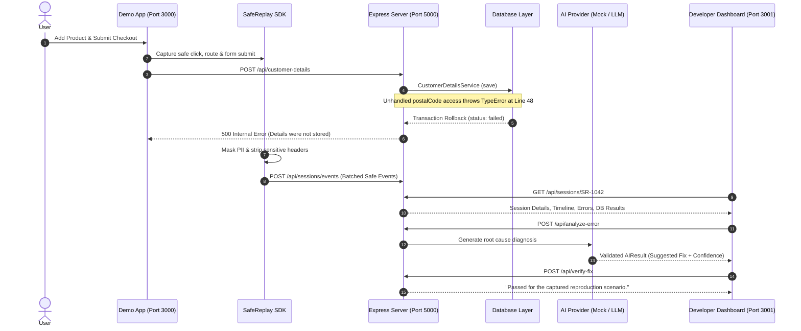

# SafeReplay Architecture & Technical Design

SafeReplay is architected as a modular TypeScript monorepo connecting client-side replay observation, privacy redaction, backend telemetry ingestion, database state tracing, allowlisted source inspection, AI root-cause analysis, and sandbox fix verification.

---

## 1. Monorepo Workspaces

```
safereplay/
├── shared/          # Shared Zod schemas and TypeScript data contracts
├── replay-sdk/      # Privacy-preserving browser capture SDK
├── demo-app/        # React + Vite shopping store application
├── dashboard/       # Developer debugging dashboard with Timeline & AI analysis
├── server/          # Node.js + Express backend with database and AI providers
└── database/        # Migrations and seed scripts
```

---

## 2. Component Interactions & Data Flow


